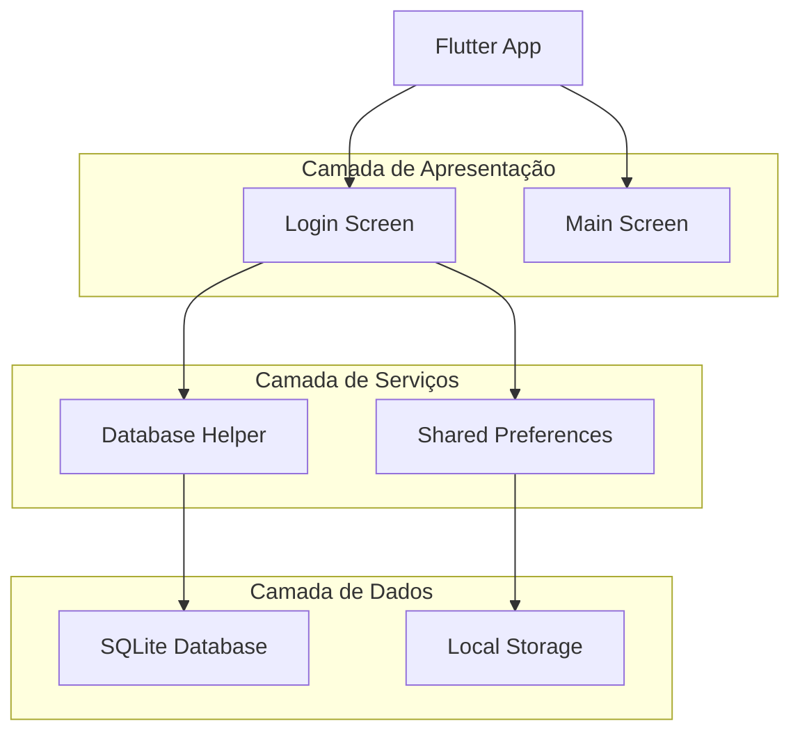
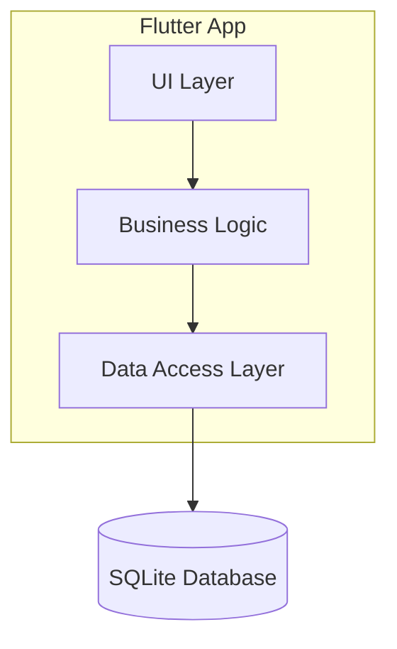
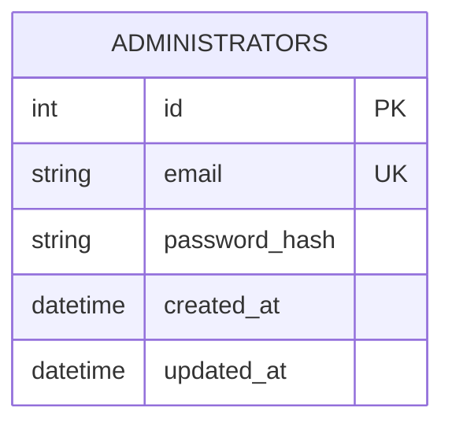

# Documento de Arquitetura Técnica - Sistema de Login CondoGaia

## 1. Design da Arquitetura



## 2. Descrição das Tecnologias

* **Frontend**: Flutter 3.9+ com Material Design

* **Banco de Dados**: SQLite (sqflite ^2.3.0)

* **Criptografia**: crypto ^3.0.3 para hash de senhas

* **Persistência**: shared\_preferences ^2.2.2 para login automático

* **Gerenciamento de Estado**: StatefulWidget nativo do Flutter

## 3. Definições de Rotas

| Rota  | Propósito                                             |
| ----- | ----------------------------------------------------- |
| /     | Tela de login inicial, ponto de entrada do aplicativo |
| /main | Tela principal após autenticação bem-sucedida         |

## 4. Definições de API (Banco de Dados Local)

### 4.1 API Principal do Banco

**Autenticação de usuário**

```dart
Future<bool> authenticateUser(String email, String password)
```

Parâmetros:

| Nome do Parâmetro | Tipo   | Obrigatório | Descrição              |
| ----------------- | ------ | ----------- | ---------------------- |
| email             | String | true        | Email do administrador |
| password          | String | true        | Senha em texto plano   |

Retorno:

| Nome do Parâmetro | Tipo | Descrição                         |
| ----------------- | ---- | --------------------------------- |
| result            | bool | true se autenticação bem-sucedida |

**Inserção de administrador**

```dart
Future<void> insertAdmin(String email, String password)
```

Parâmetros:

| Nome do Parâmetro | Tipo   | Obrigatório | Descrição                    |
| ----------------- | ------ | ----------- | ---------------------------- |
| email             | String | true        | Email do administrador       |
| password          | String | true        | Senha que será criptografada |

### 4.2 Tipos TypeScript Comuns

```dart
class Admin {
  final int? id;
  final String email;
  final String passwordHash;
  final DateTime createdAt;
  
  Admin({
    this.id,
    required this.email,
    required this.passwordHash,
    required this.createdAt,
  });
}

class LoginResult {
  final bool success;
  final String? errorMessage;
  final Admin? admin;
  
  LoginResult({
    required this.success,
    this.errorMessage,
    this.admin,
  });
}
```

## 5. Arquitetura do Servidor (Local)



## 6. Modelo de Dados

### 6.1 Definição do Modelo de Dados



### 6.2 Linguagem de Definição de Dados (DDL)

**Tabela de Administradores (administrators)**

```sql
-- Criar tabela
CREATE TABLE administrators (
    id INTEGER PRIMARY KEY AUTOINCREMENT,
    email TEXT UNIQUE NOT NULL,
    password_hash TEXT NOT NULL,
    created_at TEXT NOT NULL,
    updated_at TEXT NOT NULL
);

-- Criar índices
CREATE INDEX idx_administrators_email ON administrators(email);
CREATE INDEX idx_administrators_created_at ON administrators(created_at);

-- Inserir dados iniciais
INSERT INTO administrators (email, password_hash, created_at, updated_at)
VALUES (
    'alexsanderaugusto142019@gmail.com',
    'e10adc3949ba59abbe56e057f20f883e', -- MD5 hash de '123456'
    datetime('now'),
    datetime('now')
);
```

**Estrutura de Arquivos do Projeto:**

```
lib/
├── main.dart                 # Ponto de entrada
├── screens/
│   ├── login_screen.dart     # Tela de login
│   └── main_screen.dart      # Tela principal
├── services/
│   ├── database_helper.dart  # Gerenciador do banco
│   └── auth_service.dart     # Serviço de autenticação
├── models/
│   └── admin.dart           # Modelo de dados
└── utils/
    └── constants.dart       # Constantes da aplicação
```

**Dependências no pubspec.yaml:**

```yaml
dependencies:
  flutter:
    sdk: flutter
  cupertino_icons: ^1.0.8
  sqflite: ^2.3.0
  crypto: ^3.0.3
  shared_preferences: ^2.2.2
```

