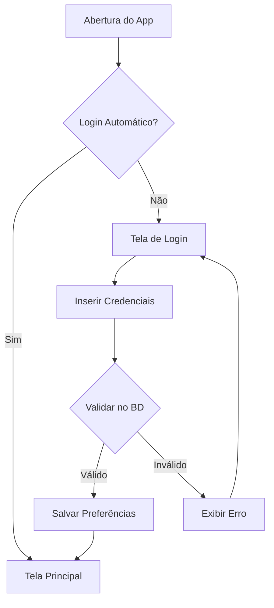

# Documento de Requisitos do Produto - Aplicativo de Login CondoGaia

## 1. Visão Geral do Produto
Aplicativo Flutter para autenticação de administradores do condomínio, com tela de login segura e persistência de dados local.
O sistema permite acesso controlado através de credenciais validadas em banco de dados SQLite local, com opção de login automático para melhor experiência do usuário.

## 2. Funcionalidades Principais

### 2.1 Papéis de Usuário
| Papel | Método de Registro | Permissões Principais |
|-------|-------------------|----------------------|
| Administrador | Pré-cadastrado no sistema | Acesso completo ao aplicativo |

### 2.2 Módulo de Funcionalidades
Nossos requisitos consistem nas seguintes páginas principais:
1. **Tela de Login**: campos de entrada, validação, botão de acesso
2. **Tela Principal**: dashboard pós-autenticação (a ser definida)

### 2.3 Detalhes das Páginas

| Nome da Página | Nome do Módulo | Descrição da Funcionalidade |
|----------------|----------------|-----------------------------|
| Tela de Login | Formulário de Acesso | Validar email e senha, opção de mostrar/ocultar senha, checkbox login automático |
| Tela de Login | Botão Entrar | Processar autenticação, navegar para tela principal em caso de sucesso |
| Tela de Login | Link Esqueci Senha | Exibir mensagem informativa (funcionalidade futura) |
| Tela Principal | Dashboard | Exibir conteúdo principal do aplicativo após login bem-sucedido |

## 3. Processo Principal

**Fluxo do Administrador:**
1. Usuário abre o aplicativo
2. Sistema verifica se há login automático ativo
3. Se não houver, exibe tela de login
4. Usuário insere email e senha
5. Sistema valida credenciais no banco local
6. Em caso de sucesso, navega para tela principal
7. Se login automático estiver marcado, salva preferência

## 4. Design da Interface do Usuário

### 4.1 Estilo de Design
- **Cores primárias**: Branco (#FFFFFF), Cinza claro (#F5F5F5)
- **Cores secundárias**: Azul (#2196F3), Cinza escuro (#424242)
- **Estilo dos botões**: Arredondados com elevação sutil
- **Fonte**: Roboto, tamanhos 16px (campos), 18px (título), 14px (labels)
- **Layout**: Centralizado, minimalista, com espaçamento generoso
- **Ícones**: Material Design Icons

### 4.2 Visão Geral do Design das Páginas

| Nome da Página | Nome do Módulo | Elementos da UI |
|----------------|----------------|----------------|
| Tela de Login | Cabeçalho | Título "Acesso" centralizado, fonte Roboto 24px, cor #424242 |
| Tela de Login | Campos de Entrada | TextField com bordas arredondadas, placeholder cinza, ícone de visibilidade para senha |
| Tela de Login | Checkbox | Checkbox Material Design com texto "Login Automático" |
| Tela de Login | Botão Principal | Botão azul (#2196F3) com texto branco "Entrar", largura total |
| Tela de Login | Link Secundário | Texto "Esqueci a senha" em azul, sublinhado, alinhado à direita |

### 4.3 Responsividade
O aplicativo é mobile-first com adaptação para diferentes tamanhos de tela, otimizado para interação touch e compatível com Android e iOS.