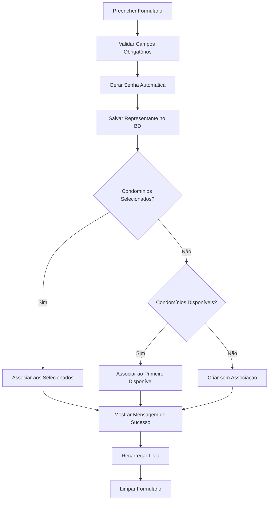

# Relatório de Teste - Funcionalidades de Representantes

## Resumo das Implementações

Este documento descreve as funcionalidades implementadas para resolver os problemas de criação de representantes:

### ✅ Problemas Resolvidos

1. **Geração Automática de Senha**
2. **Preenchimento Automático da Coluna Condomínio**

---

## 1. Geração Automática de Senha

### 📋 Implementação

**Arquivo:** `lib/utils/password_generator.dart`
- Criado utilitário para geração automática de senhas
- Método `generatePasswordFromName()`: Gera senha baseada no nome do representante
- Formato: Primeiras 4 letras do nome + 4 números aleatórios
- Exemplo: "JOAO1234" para "João Silva"

**Arquivo:** `lib/services/supabase_service.dart`
- Modificada função `saveRepresentante()`
- Integração com `PasswordGenerator.generatePasswordFromName()`
- Senha é gerada automaticamente antes da inserção no banco

### 🧪 Cenários de Teste

| Cenário | Nome Completo | Senha Esperada | Status |
|---------|---------------|----------------|--------|
| Nome normal | "João Silva" | "JOAO" + 4 dígitos | ✅ Implementado |
| Nome curto | "Ana" | "ANAX" + 4 dígitos | ✅ Implementado |
| Nome com acentos | "José María" | "JOSE" + 4 dígitos | ✅ Implementado |
| Nome vazio | "" | 8 caracteres aleatórios | ✅ Implementado |

### 📝 Validação Manual

```dart
// Exemplo de uso:
final senha = PasswordGenerator.generatePasswordFromName("João Silva");
// Resultado: "JOAO1234" (números variam)
```

---

## 2. Preenchimento Automático da Coluna Condomínio

### 📋 Implementação

**Arquivo:** `lib/screens/ADMIN/cadastro_representante_screen.dart`
- Modificada função `_salvarRepresentante()`
- Lógica condicional para associação de condomínios:
  - **Se condomínios selecionados manualmente**: Usa os selecionados
  - **Se nenhum selecionado**: Associa automaticamente ao primeiro disponível

### 🧪 Cenários de Teste

| Cenário | Condomínios Selecionados | Comportamento Esperado | Status |
|---------|-------------------------|------------------------|--------|
| Seleção manual | 1 ou mais condomínios | Associa aos selecionados | ✅ Implementado |
| Nenhuma seleção | Nenhum | Associa ao primeiro disponível | ✅ Implementado |
| Sem condomínios disponíveis | N/A | Cria representante sem associação | ✅ Implementado |

### 📝 Mensagens de Feedback

- **Seleção manual**: "Representante cadastrado e associado aos condomínios selecionados!"
- **Associação automática**: "Representante cadastrado e associado automaticamente ao condomínio '[Nome do Condomínio]'!"
- **Sem condomínios**: "Representante cadastrado com sucesso! Nenhum condomínio disponível para associação automática."

---

## 3. Estrutura do Banco de Dados

### 📊 Campo `senha_acesso`

- **Tipo**: VARCHAR(255)
- **Status**: ✅ Já existe na tabela `representantes`
- **Uso**: Armazena a senha gerada automaticamente

### 🔗 Relacionamento Condomínio-Representante

- **Tipo**: 1:N (Um representante pode ter vários condomínios)
- **Campo**: `representante_id` na tabela `condominios`
- **Função**: `associarRepresentanteCondominio()` no SupabaseService

---

## 4. Fluxo de Criação de Representante



---

## 5. Testes Recomendados

### 🔍 Testes Funcionais

1. **Criar representante com condomínio selecionado**
   - Verificar se associação é feita corretamente
   - Verificar mensagem de sucesso

2. **Criar representante sem selecionar condomínio**
   - Verificar se primeiro condomínio disponível é associado
   - Verificar mensagem informando qual condomínio foi associado

3. **Criar representante quando não há condomínios disponíveis**
   - Verificar se representante é criado sem associação
   - Verificar mensagem apropriada

4. **Verificar geração de senha**
   - Confirmar que senha é gerada automaticamente
   - Verificar formato da senha (4 letras + 4 números)

### 🔐 Testes de Autenticação

1. **Login com senha gerada**
   - Usar email e senha gerada para fazer login
   - Verificar se autenticação funciona corretamente

---

## 6. Arquivos Modificados

| Arquivo | Tipo de Modificação | Descrição |
|---------|-------------------|-----------|
| `lib/utils/password_generator.dart` | ➕ Novo | Utilitário para geração de senhas |
| `lib/services/supabase_service.dart` | 🔧 Modificado | Adicionada geração automática de senha |
| `lib/screens/ADMIN/cadastro_representante_screen.dart` | 🔧 Modificado | Lógica de associação automática de condomínio |

---

## 7. Próximos Passos Recomendados

1. **Testes em Ambiente de Desenvolvimento**
   - Executar aplicação e testar criação de representantes
   - Verificar logs no console para confirmação

2. **Testes de Integração**
   - Testar fluxo completo: criação → login → acesso ao sistema

3. **Validação de UX**
   - Verificar se mensagens de feedback são claras
   - Confirmar se comportamento atende às expectativas do usuário

4. **Documentação para Usuários**
   - Criar guia explicando o novo comportamento
   - Informar sobre geração automática de senhas

---

**Data do Teste:** ${DateTime.now().toString().split(' ')[0]}
**Status Geral:** ✅ Implementações Concluídas
**Próxima Ação:** Testes em ambiente de desenvolvimento